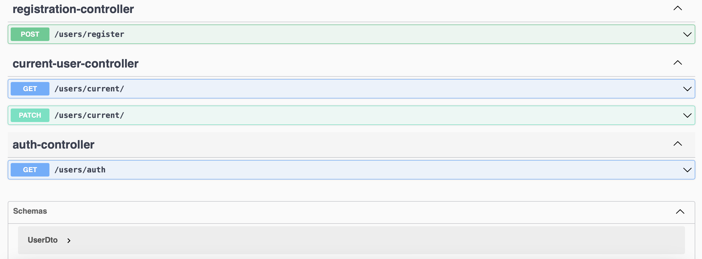
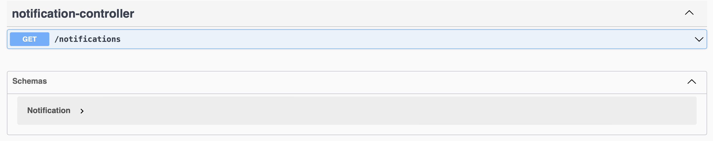

ДЗ 7 Паттерны декомпозиции микросервисов

Функционал онлайн-магазина поделен между 4 микросервисами: users, orders, billing, notifications

В папке /schemas расположены файлы, описывающие общую схему взаимодействия мокросервисов и пользовательские сценарии. Так же для каждого сервиса описано назначение сервиса и его зону ответственности. 

Контракты сервисов:

USERS

ORDERS

BILLING

NOTIFICATIONS

