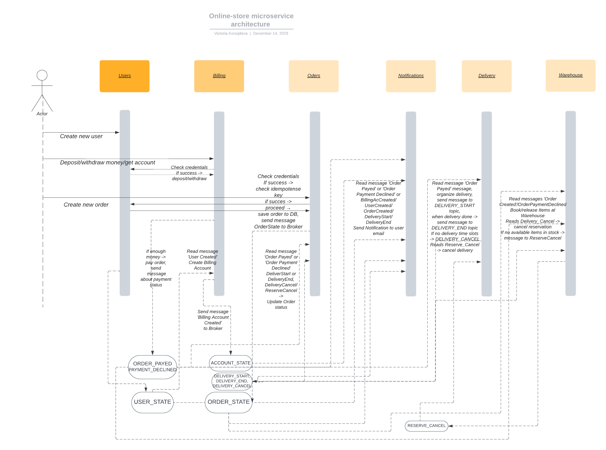

Онлайн-магазин/Online-Store webapp

Функционал онлайн-магазина поделен между 6 микросервисами: users, orders, billing, delivery, warehouse, notifications

Пользовательские сценарии:

Запуск приложения из консоли в minikube/start application:

minikube start --memory 7400 --cpus 4

KAFKA
kubectl create namespace kafka
kubectl create -f 'https://strimzi.io/install/latest?namespace=kafka' -n kafka
kubectl get pod -n kafka --watch
//wait
kubectl apply -f https://strimzi.io/examples/latest/kafka/kafka-persistent-single.yaml -n kafka 
kubectl wait kafka/my-cluster --for=condition=Ready --timeout=300s -n kafka 

ISTIO

cd istio-1.18.2
export PATH=$PWD/bin:$PATH
istioctl install --set profile=demo -y
kubectl label namespace default istio-injection=enabled

REDIS(only one replica for resources control)
helm install redis-service --set auth.password=VgUQ9mjbH3 --set cluster.slaveCount=0 bitnami/redis
get redis password
export REDIS_PASSWORD=$(kubectl get secret --namespace default redis-test -o jsonpath="{.data.redis-password}" | base64 --decode)
set password to oreders-chart configmap

APP charts

WITH HELMFILE command:
inside /charts folder
helmfile apply
to uninstall all releases: helmfile delete --purge

GATEWAY
kubectl apply -f gateway.yaml

minikube tunnel

VIEW the DASHBOARDS
from root:
cd istio
kubectl apply -f samples/addons
kubectl rollout status deployment/kiali -n istio-system
istioctl dashboard kiali

TESTING
RUN REQUEST COLLECTION

npm install -g newman
newman run Otus-hw8.postman_collection.json

